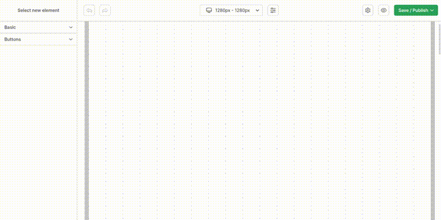

# react-web-builder
React library for building pages with the ability to use own declared components.

```sh
npm install react-web-builder
```



## Live

See <a href="https://react-web-builder.100bit.pl">live example</a>

## Documentation

See <a href="https://github.com/sasza2/react-web-builder/tree/master/docs/00-INTRODUCTION.md">documentation</a>
