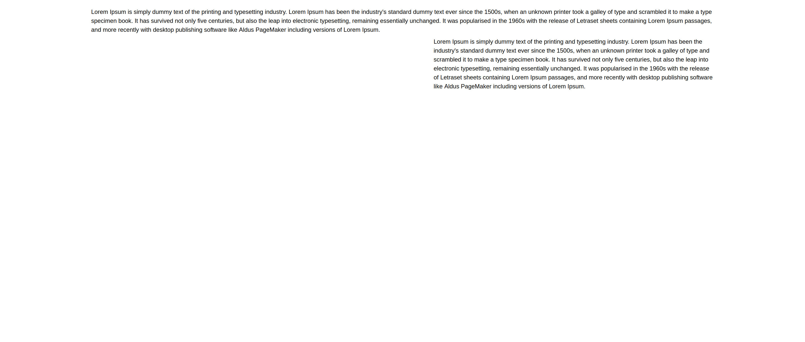

# react-web-builder
React library for building pages with the ability to use own declared components.

```sh
npm install react-web-builder
```

<a href="https://react-web-builder.100bit.pl">Live Example</a>

# <span id="builder">Builder</span>
Component for building page


<br />

<span id="example">Code example</span>
```jsx
import Builder, { Page } from 'react-web-builder'

/// ...

const onPublish = (page: Page) => {
  /*
    page object should be saved (for example
    in some database)
  */
}

return (
  <Builder
    onPublish={onPublish}
  )
/>
```

# View
Component for displaying page created by `<Builder />` component



^ Screenshot of page generated by <a href="#builder">builder example</a> above

```jsx
import View from 'react-web-builder/View'

/// ...

return (
  <View
    page={page}
  >
)
```

<a href="https://react-web-builder.100bit.pl/?story=view--published-story">LIVE</a> - available after publishing <a href="#builder">builder example</a> by clicking `Save / Publish` button in top right corner

## Components
Builder has default components to be used like Text, Image, Video, Line, Separator, HTML iFrame and Custom button. It is possible to pass as prop own components (<a href="./01-COMPONENTS.md">read more</a>).

## Page object
`page` is an object that is produced by `<Builder />` component. Should be used by `<View />` component to display created content. Best way is to save `page` object on backend (<a href="./02-PAGE.md">read more</a>).

## \<Builder \/\> properties
| Prop | Type | Description |
| --- | --- | --- |
| components | WebBuilderComponent[] | More about <a href="./01-COMPONENTS.md">components</a> |
| container | React component | Wrapper for all components in builder grid with props:<br />- backgroundColor<br />- <a href="./02-BREAKPOINTS.md">breakpoint</a><br />- <a href="./02-PAGE.md">page</a> |
| defaultBoxContent | <a href="./01-COMPONENTS.md#richtext">TextElement[]</a> | Default content for <a href="./01-COMPONENTS.md#box">Box</a> component |
| defaultButtonBackgroundColor | string | Default color as hex for custom button |
| defaultButtonAvailable | boolean | Is custom button component available |
| defaultButtonContent | <a href="./01-COMPONENTS.md#richtext">TextElement[]</a> | Default content for Custom button component |
| defaultButtonHref | string | Default location of custom button component |
| defaultImageSrc | string | Default source for image component |
| defaultVideoSrc | string | Default source for video component |
| fonts | FontImport[] | More about <a href="./05-FONTS.md">fonts</a> |
| translations | Translations | More about <a href="./06-TRANSLATIONS.md">translations</a> |
| transformElementProperty | functon | More about <a href="./01-COMPONENTS.md#transform-properties">transform properties</a> |
| page | Page | More about <a href="./02-PAGE.md">page</a> |
| builderHints | HelperArrowItem[] | More about <a href="./07-BUILDER-HINTS.md">hints</a> |
| navbarIcons | WebBuilderNavbarIcon[] | More about <a href="./08-NAVBAR-ICONS.md">navbar icons</a> 
| pageSettingsExtra | WebBuilderComponentProperty[] | Feature to adding extra page settings. It's using same structure as <a href="./01-COMPONENTS.md#props">componentent props</a> |
| presetColors | string[] | Preset colors that are displayed in section "Preset colors" of color component |
| onAutoSave | function | Callback with `page` on each change in builder. Works only if option "Auto save" in configuration (top right edge) is ON |
| onChange | function | Callback with `page` on every change |
| onAboutClick | function | Callback on click on <a href="./01-COMPONENTS.md#about">about</a> component |
| onExit | function | Callback on click "Exit" in "Save / Publish" options" |
| onImageUpload | function | More about <a href="./09-IMAGE-UPLOAD.md">Image upload</a> |
| onPublish | function | Callback on click "Publish" page (<a href="#example">Example</a>) |
| onSaveAsDraft | function | Callback with `page` on click "Save as draft" |
| onPagePreview | function | Callback with `page` on click icon "Preview" |

## \<View \/\> properties

| Prop | Description |
| --- | --- |
| components | All below props are the same type as in builder. if any of them is passed to `<Builder />` component they should be also applied to `<View />` |
| container | - |
| defaultBoxContent | - |
| defaultButtonBackgroundColor | - |
| defaultButtonAvailable | - |
| defaultButtonContent | - |
| defaultButtonHref | - |
| defaultImageSrc | - |
| defaultVideoSrc | - |
| fonts | - |
| translations | - |
| transformElementProperty | - |
| page | * page in view is required |

## Breakpoints
Library supports multiple breakpoints. Default breakpoints are 360px (mobile) and 1280px (desktop). They can be changed programmaticaly in `page` prop or in user interface by client.<br />
(<a href="./03-BREAKPOINTS.md">read more</a>)

## Templates
Templates allow to programmatically place elements on Builder grid. Template is loaded during opening builder.<br />
(<a href="./04-TEMPLATES.md">read more</a>)<br />

## Fonts
It is possible to declare fonts that can be used in Builder (<a href="./05-FONTS.md">see more</a>).

## Translations
Translations can be passed with `translation` locale (read more).
