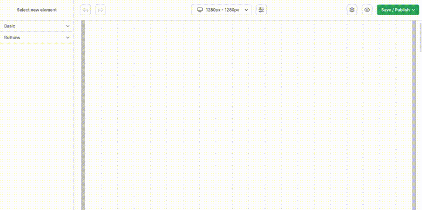
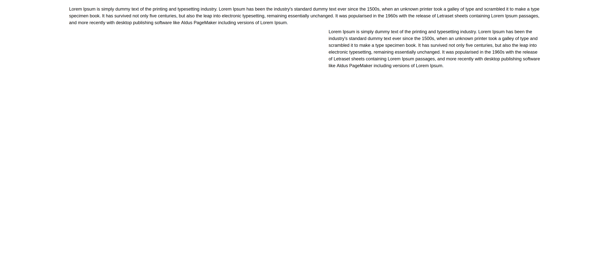

# Introduction

`react-web-builder` is a drag & drop page builder for React. It ships two components:

- **`<WebBuilder />`** - the editor, where users compose a page on a responsive grid.
- **`<View />`** - the renderer, which turns the saved `page` object back into a page.

Everything the user can drop onto the grid is a React component - including your own.

```sh
npm install react-web-builder
```

[Live example](https://react-web-builder.100bit.pl)

**Contents**

1. [Introduction](./00-INTRODUCTION.md) - you are here
2. [Components](./01-COMPONENTS.md)
3. [Page object](./02-PAGE.md)
4. [Breakpoints](./03-BREAKPOINTS.md)
5. [Templates](./04-TEMPLATES.md)
6. [Fonts](./05-FONTS.md)
7. [Translations](./06-TRANSLATIONS.md)
8. [Builder hints](./07-BUILDER-HINTS.md)
9. [Navbar icons](./08-NAVBAR-ICONS.md)
10. [Image upload](./09-IMAGE-UPLOAD.md)
11. [Containers](./10-CONTAINERS.md)
12. [The editor](./11-EDITOR.md)

---

## <span id="builder">Builder</span>

The component used to build a page.



<br />

<span id="example">Code example</span>

```jsx
import Builder, { Page } from 'react-web-builder'

// ...

const onPublish = async (page: Page) => {
  /*
    The `page` object should be persisted - for example
    in your database - so it can later be passed to <View />
  */
  await savePage(page)
}

return (
  <Builder
    onPublish={onPublish}
  />
)
```

## View

The component that displays a page created by `<Builder />`.



^ Screenshot of the page generated by the [builder example](#builder) above.

```jsx
import View from 'react-web-builder/View'

// ...

return (
  <View
    page={page}
  />
)
```

[LIVE](https://react-web-builder.100bit.pl/?story=view--published-story) - available after publishing the [builder example](#builder) with the `Save / Publish` button in the top-right corner.

> **Important:** every prop that affects rendering - `components`, `container`, `fonts`, `transformElementProperty` and the `default*` props - must be passed to **both** `<Builder />` and `<View />`. Otherwise the published page will not look the way it did in the editor.

## Components

The builder ships with a set of default components: Container, Text, Image, Video, Line, Separator, iFrame, Anchor, HTML and a custom button. You can also pass your own components through the `components` prop ([read more](./01-COMPONENTS.md)).

## Page object

`page` is the object produced by `<Builder />`. It is plain, serializable JSON and is consumed by `<View />` to display the created content. The recommended approach is to store it on your backend ([read more](./02-PAGE.md)).

## `<Builder />` properties

Alongside the [shared properties](#shared-properties) below, the builder accepts:

| Prop | Type | Description |
| --- | --- | --- |
| builderHints | HelperArrowItem[] | One-off hints pointing at DOM elements ([read more](./07-BUILDER-HINTS.md)) |
| enableDownload | boolean | Show the "download page" action, which saves the `page` object to a file |
| enableUpload | boolean | Show the "upload page" action, which loads a `page` object from a file |
| navbarIcons | WebBuilderNavbarIcon[] | Extra toolbar buttons ([read more](./08-NAVBAR-ICONS.md)) |
| pageSettingsExtra | WebBuilderComponentProperty[] | Extra fields in page settings. Uses the same structure as [component props](./01-COMPONENTS.md#props) |
| presetColors | string[] | Colors listed under "Preset colors" in every color picker |
| onAutoSave | (page: Page) => void | Called with `page` on each change, but only while "Auto save" (configuration menu, top-right corner) is ON |
| onChange | (page: Page) => void | Called with `page` on every change. Use for previews or undo stacks, not for network calls |
| onAboutClick | (button) => void | Called when the button of an [about](./01-COMPONENTS.md#about) property is clicked |
| onBeforeDownloadPage | (page: Page) => { filename?, page? } | Adjust the file name or payload before a page is downloaded |
| onExit | () => Promise\<void\> | Called on "Exit" in the "Save / Publish" menu |
| onImageUpload | (file) => Promise\<ImageURL\> | Upload handler ([read more](./09-IMAGE-UPLOAD.md)) |
| onPublish | (page: Page) => Promise\<unknown\> | Called on "Publish" ([example](#example)) |
| onSaveAsDraft | (page: Page) => Promise\<unknown\> | Called with `page` on "Save as draft" |
| onPagePreview | (page: Page) => Promise\<unknown\> | Called with `page` when the "Preview" icon is clicked |
| onTemplateRestart | () => Page | Return a fresh page when the user restarts the [template](./04-TEMPLATES.md) |

## <span id="shared-properties">Shared properties (`<Builder />` and `<View />`)</span>

| Prop | Type | Description |
| --- | --- | --- |
| components | WebBuilderComponent[] | Your own components ([read more](./01-COMPONENTS.md)) |
| container | React component | Wrapper around all components on the grid. Receives `backgroundColor`, [`breakpoint`](./03-BREAKPOINTS.md), [`page`](./02-PAGE.md) and `children` |
| elementContainerDecorator | React component | Wrapper rendered around each element on the grid. Receives `container` and `children` |
| defaultBoxContent | [TextElement[]](./01-COMPONENTS.md#richtext) | Default content of the [Text](./01-COMPONENTS.md#box) component |
| defaultButtonAvailable | boolean | Whether the custom button component is available |
| defaultButtonBackgroundColor | string | Default color (hex) of the custom button |
| defaultButtonContent | [TextElement[]](./01-COMPONENTS.md#richtext) | Default content of the custom button |
| defaultButtonHref | string | Default link of the custom button |
| defaultImageSrc | string | Default source of the image component |
| defaultVideoSrc | string | Default source of the video component |
| fonts | FontImport[] | Available fonts ([read more](./05-FONTS.md)) |
| translations | Translations | UI translations ([read more](./06-TRANSLATIONS.md)) |
| transformElementProperty | function | Rewrite property values before they reach your components ([read more](./01-COMPONENTS.md#transform-properties)) |
| page | Page | Page to load ([read more](./02-PAGE.md)). **Required** on `<View />` |

## Breakpoints

The library supports multiple breakpoints. The defaults are 360px (mobile) and 1280px (desktop). They can be changed programmatically through the `page` prop, or by the user in the interface.<br />
([read more](./03-BREAKPOINTS.md))

## Templates

Templates place elements on the builder grid programmatically. A template is applied when the builder opens, so users start from a prepared layout instead of a blank canvas.<br />
([read more](./04-TEMPLATES.md))

## Fonts

You can declare the fonts that are selectable in the builder ([read more](./05-FONTS.md)).

## Translations

The interface can be translated by passing a locale object through the `translations` prop ([read more](./06-TRANSLATIONS.md)).

## Entry points

| Import | Contents |
| --- | --- |
| `react-web-builder` | `WebBuilder` (default export) and all types |
| `react-web-builder/View` | `View` (default export) and types |
| `react-web-builder/Box` | `Box` - renders [richtext](./01-COMPONENTS.md#richtext) values |
| `react-web-builder/useBoxStyle` | `useBoxStyle` - turns border / shadow / padding values into `React.CSSProperties` |
| `react-web-builder/components` | `Box`, `Image`, `Line`, `Video`, `IFrame`, `useElementContainer` |
