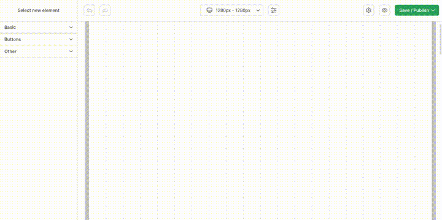
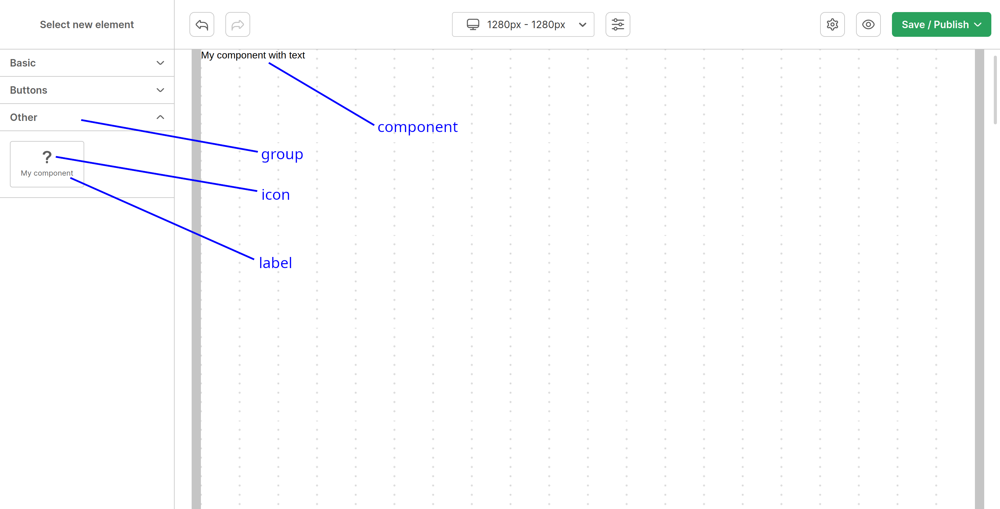
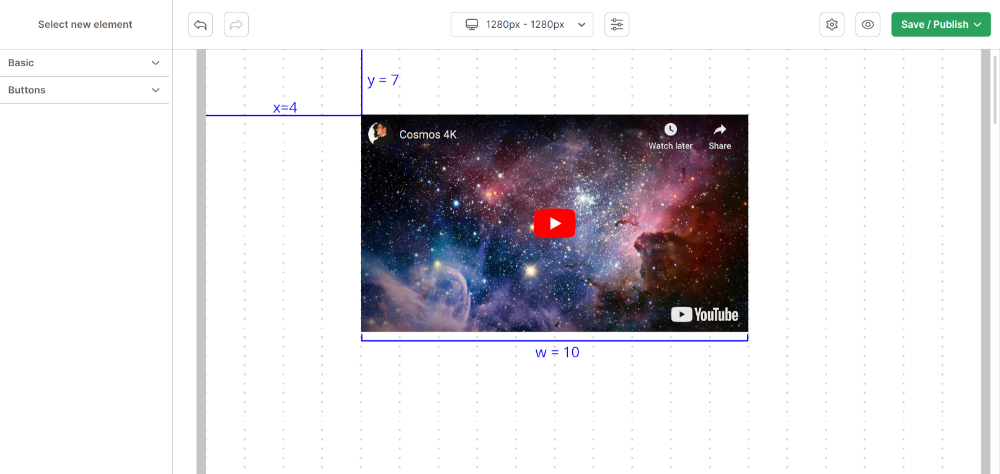

# Components
List of components that can be used in builder

## Simple component example

```jsx
import WebBuilder from 'react-web-builder'

const MyComponent = () => (
  <div>
    My component with text
  </div>
)

const components = [
  {
    id: 'myComponent',
    label: 'My component',
    component: MyComponent,
  }
]

export function ComponentsExample() {
  return (
    <WebBuilder
      components={components}
      onPublish={onPublish}
    />
  )
}
```



## Component props

| Name | Type | Description |
| --- | --- | --- |
| id | string | id of component, should be unique |
| label | string | name of component |
| component | React component | component to render |
| icon | React component | icon displayed in sidebar |
| defaultWidth | number | default width of component in grid columns |
| group | WebBuilderGroup | group of component. default is other. could be list of groups |
| group.id | string | group id |
| group.label | string | name of group |
| group.order | number | group order |
| props | WebBuilderProps | properties (<a href="#types">see below</a>) |
| order | number | order of component in group |



## <span id="props">Adding properties to component</span>

```jsx
const MyComponent = ({
  about,
  backgroundColor,
}) => (
  <div style={{ backgroundColor }}>
    {about}
  </div>
)

const components = [
  {
    id: 'myComponent',
    label: 'My component',
    component: MyComponent,
    props: [
      {
        id: 'about',
        label: 'About',
        type: 'text',
        defaultValue: 'My component with text',
      },
      {
        id: 'backgroundColor',
        label: 'Background color',
        type: 'color',
      }
    ]
  }
]
```


## <span id="types">Types of properties</span>

all props must have unique `id` in component

### toggle
Switch button

| Prop | Type | Description |
| --- | --- | --- |
| defaultValue | boolean | default value for switch button |

### text
input field (single line)

| Prop | Type | Description |
| --- | --- | --- |
| defaultValue | string | default value for text input |

### number
Range component for pick between `<min, max>` value. default value is 0 for `min` and 20 for `max`

| Prop | Type | Description |
| --- | --- | --- |
| defaultValue | number | - |
| min | number | default value 0 |
| max | number | default value 20 |

### <span id="richtext">richtext</a>
Rich text content field

| Prop | Type | Description |
| --- | --- | --- |
| colorAvailable | boolean | is "color change" feature available |
| hyperlinkAvailable | boolean | is "link feature" available |
| defaultValue[].align | string | CSS <a href="https://www.w3schools.com/cssref/pr_text_text-align.php">text-align</a> |
| defaultValue[].type | paragraph | - |
| defaultValue[].letterSpacing | string | CSS <a href="https://www.w3schools.com/cssref/pr_text_letter-spacing.php">letter-spacing</a> |
| defaultValue[].lineHeight | string | CSS <a href="https://www.w3schools.com/cssref/pr_dim_line-height.php">line-height</a> |
| defaultValue[].children[].bold | boolean | is text thick |
| defaultValue[].children[].italic | boolean | is font style italic |
| defaultValue[].children[].underline | boolean | underline in text |
| defaultValue[].children[].fontSize | number | font size in pixels (number) |
| defaultValue[].children[].color | string | font hex color, starting from # |
| defaultValue[].children[].text | string | just text like 'Hello world' |
| defaultValue[].children[].link | string | link destination  |

<span id="box">Example</span> of using Box component to render value of richtext

```jsx
import WebBuilder from 'react-web-builder'
import Box from 'react-web-builder/Box'

const MyComponent = ({ content }) => (
  <div>
    Content:
    <Box content={content} />
  </div>
)

const components = [
  {
    id: 'myComponent',
    label: 'My component',
    component: MyComponent,
    props: [
      {
        id: 'content',
        label: 'Content',
        type: 'richtext',
      },
    ],
  }
]

export function RichTextExample() {
  return (
    <WebBuilder
      components={components}
      onPublish={onPublish}
    />
  )
}
```

### html
textarea for HTML

### select
dropdown with options

| Prop | Type | Description |
| --- | --- | --- |
| options[].value | string | unique value of option |
| options[].label | string | name of option |

### padding
dropdown with options

| Prop | Type | Description |
| --- | --- | --- |
| padding.top | number | top padding in px |
| padding.right | number | right padding in px |
| padding.bottom | number | bottom padding in px |
| padding.left | number | left padding in px |

### border
helper fields for setting border in component

| Prop | Type | Description |
| --- | --- | --- |
| border.top | number | height of top border in px |
| border.right | number | width of right border in px |
| border.bottom | number | height of bottom border in px |
| border.left | number | width of left border in px |
| border.radius | number | border radius in px |
| border.color | string | border color starting from # |

### list
draggable list

| Prop | Type | Description |
| --- | --- | --- |
| options[].id | string | unique id of option |
| options[].label | string | name of option |

### fontOptions
same as richtext, but `text` is static (can't be changed)

| Prop | Type | Description |
| --- | --- | --- |
| defaultValue.bold | boolean | is text thick |
| defaultValue.italic | boolean | is font style italic |
| defaultValue.underline | boolean | underline in text |
| defaultValue.letterSpacing | string | CSS <a href="https://www.w3schools.com/cssref/pr_text_letter-spacing.php">letter-spacing</a> |
| defaultValue.lineHeight | string | CSS <a href="https://www.w3schools.com/cssref/pr_dim_line-height.php">line-height</a> |
| defaultValue.textAlign | string | CSS <a href="https://www.w3schools.com/cssref/pr_text_text-align.php">text-align</a> |
| defaultValue.size | number | font size in pixels (number) |

### url
input field for setting url

| Prop | Type | Description |
| --- | --- | --- |
| defaultValue.location | string | url location |
| defaultValue.openInNewTab | boolean | open in new tab |
| openInNewTab | boolean | is toggle 'open in new tab' visible

### <span id="about">about</span>
helper for displaying information about component with ability to add button with link. could be helpful when some content of component is set in external app

| Prop | Type | Description |
| --- | --- | --- |
| description | string | text to display |
| button.label | string | button text |
| button.description | string | button url |

### color
color picker

| Prop | Type | Description |
| --- | --- | --- |
| defaultValue | string | default color |

### hidden
hidden component

## visiblity function
Each item of props[] can use visibility function which allow to decide whether to be visible. if output of visibility function is truthy it will be displayed in sidebar

```ts
{
  visibility?: (props: {
    breakpoint: Breakpoint,
    element: WebBuilderElement,
    formValues: Record<string, unknown>,
    prop: WebBuilderComponentProperty
  }) => boolean,
}
```

- More about <a href="./03-BREAKPOINTS.md">breakpoint</a>
- More about <a href="#element">element</a>
- formValues are current values of declared properties in element
- More about <a href="#props">prop</a>

example:
```jsx
{
  id: 'myComponent',
  label: 'My component',
  component: MyComponent,
  props: [
    {
      id: 'showAvatar',
      label: 'Show avatar',
      type: 'toggle',
    },
    {
      id: 'avatarColor',
      label: 'Avatar color',
      type: 'color',
      visibility: ({ formValues }) => formValues.showAvatar
    }
  ]
}
```

### <span id="element">WebBuilderElement</span>
it's an element on grid created from component

| Prop | Type | Description |
| --- | --- | --- |
| description | string | text to display |
| w | number | width in columns |
| x | number | x position in grid (column) |
| y | number | y position in grid (row) |
| id | string | unique id of element |
| breakpointId | string | breakpoint id |
| componentName | string | component name |
| props[].id | string | id of <a href="#props">property</a> |
| props[].value | unknown | value of <a href="#props">property</a> |



## <span id="transform-properties">Transform properties</span>
Feature for transforming values of properties. Could be helpful when dealing with images and button redirects

```jsx
import WebBuilder, {
  WebBuilderComponentProperty, WebBuilderElementProperty,
} from 'react-web-builder'

const transformElementProperty = (
  componentProp: WebBuilderComponentProperty,
  elementProp: WebBuilderElementProperty,
): unknown => {
  if (componentProp?.type !== 'url') return elementProp.value

  return {
    ...elementProp.value,
    // some imaginary function
    location: doSomethingWithLocation(elementProp.value),
  }
}

export function TransformElementStory() {
    return (
    <WebBuilder
      transformElementProperty={transformElementProperty}
    />
  )
}

```