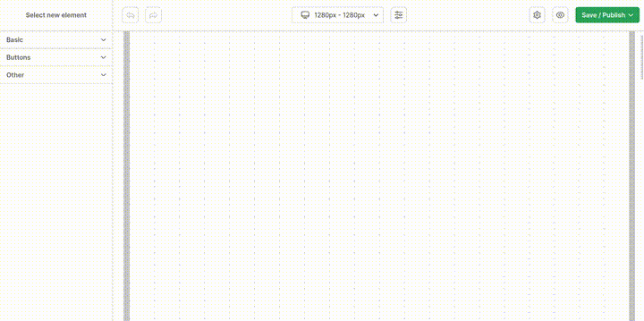
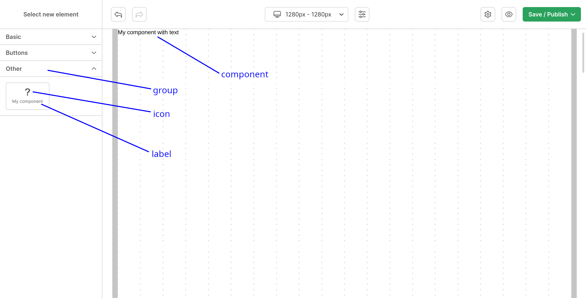
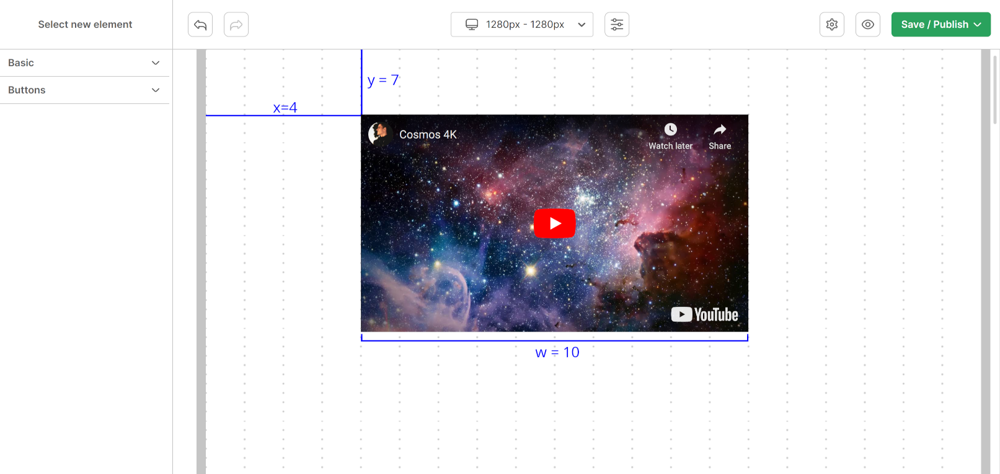

# Components

Every block a user can drop onto the grid is a React component. This page explains the components that ship with the builder, how to register your own, and how to give them editable properties.

**On this page**

- [Built-in components](#built-in)
- [A minimal component](#minimal)
- [Component definition](#definition)
- [Adding properties](#props)
- [Property types](#types)
- [Default values](#default-values)
- [Conditional properties](#visibility)
- [WebBuilderElement](#element)
- [Transform properties](#transform-properties)

---

## <span id="built-in">Built-in components</span>

| Component | `componentName` | Notes |
| --- | --- | --- |
| Container | `Container` | Section wrapper with its own column count, background color, background image, padding and height |
| Text | `Box` | Rich text block, rendered by [`Box`](#box) |
| Image | `Image` | Source, link, border and shadow. Supports [image upload](./09-IMAGE-UPLOAD.md) |
| Video | `Video` | Backed by [react-player](https://github.com/cookpete/react-player) |
| Custom button | `CustomButton` | Enabled with `defaultButtonAvailable` |
| Line | `Line` | Solid or dashed, with configurable height, gap and radius |
| Separator | `Separator` | Empty vertical space |
| iFrame | `Iframe` | Embeds an external page |
| Anchor | `Anchor` | Scroll target for in-page links |
| HTML | `HTMLComponent` | Raw HTML snippet |

The `componentName` values are what you use when building a [template](./04-TEMPLATES.md). Components passed through the `components` prop are added to this list.

### Overriding a built-in component

Components are merged by `id`. Registering a component with the id of a built-in one therefore does not create a second entry - it **overrides** the built-in, field by field, and merges the two `props` arrays by property id.

This is the supported way to adjust the defaults instead of rebuilding a component from scratch:

```jsx
const components = [
  // rename the Text component and give it a different icon,
  // keeping its behaviour and all of its properties
  {
    id: 'Box',
    label: 'Paragraph',
    icon: ParagraphIcon,
  },
  // replace the Video component entirely
  {
    id: 'Video',
    label: 'Video',
    component: MyPlayer,
  },
]
```

Because the merge happens per property id, adding a property that the built-in already declares replaces just that one, and any property you do not mention is left untouched.

## <span id="minimal">A minimal component</span>

```jsx
import WebBuilder from 'react-web-builder'

const MyComponent = () => (
  <div>
    My component with text
  </div>
)

const components = [
  {
    id: 'myComponent',
    label: 'My component',
    component: MyComponent,
  },
]

export function ComponentsExample() {
  return (
    <WebBuilder
      components={components}
      onPublish={onPublish}
    />
  )
}
```



> Pass the same `components` array to `<View />`, otherwise the published page has nothing to render with.

## <span id="definition">Component definition</span>

| Name | Type | Description |
| --- | --- | --- |
| id | string | Unique id of the component |
| label | string \| JSX | Name shown in the sidebar |
| component | React component | The component to render |
| icon | React component | Icon shown in the sidebar |
| defaultWidth | number \| function | Default width in grid columns. As a function it receives `{ component, breakpoint }` and returns a number |
| expandToWindowWidth | boolean | Let the element stretch to the full window width, ignoring the grid padding |
| group | WebBuilderGroup \| WebBuilderGroup[] | Sidebar group (or groups). Defaults to "other" |
| group.id | string | Group id |
| group.label | string \| JSX | Group name |
| group.order | number | Group order in the sidebar |
| isContainer | boolean | Marks the component as a container that other elements can be placed into |
| props | WebBuilderComponentProperty[] | Editable properties ([see below](#props)) |
| order | number | Order of the component inside its group |
| resizable | boolean | Whether the user can resize the element (default: yes) |



## <span id="props">Adding properties to a component</span>

Each entry in `props` renders a field in the sidebar, and its value is passed to your component as a prop named after the property `id`.

```jsx
const MyComponent = ({
  about,
  backgroundColor,
}) => (
  <div style={{ backgroundColor }}>
    {about}
  </div>
)

const components = [
  {
    id: 'myComponent',
    label: 'My component',
    component: MyComponent,
    props: [
      {
        id: 'about',
        label: 'About',
        type: 'text',
        defaultValue: 'My component with text',
      },
      {
        id: 'backgroundColor',
        label: 'Background color',
        type: 'color',
      },
    ],
  },
]
```


A more complete example, combining several property types:

```jsx
const Hero = ({ title, subtitle, backgroundColor, cta, padding, rounded }) => (
  <section
    style={{
      backgroundColor,
      borderRadius: rounded ? 16 : 0,
      paddingTop: padding?.top,
      paddingBottom: padding?.bottom,
    }}
  >
    <h1>{title}</h1>
    <p>{subtitle}</p>
    <a href={cta?.location} target={cta?.openInNewTab ? '_blank' : undefined} rel="noreferrer">
      Get started
    </a>
  </section>
)

const components = [
  {
    id: 'hero',
    label: 'Hero section',
    component: Hero,
    icon: HeroIcon,
    defaultWidth: ({ breakpoint }) => breakpoint.cols,
    group: { id: 'marketing', label: 'Marketing', order: 1 },
    order: 0,
    props: [
      { id: 'title',           label: 'Title',           type: 'text',    defaultValue: 'Ship faster' },
      { id: 'subtitle',        label: 'Subtitle',        type: 'text' },
      { id: 'backgroundColor', label: 'Background',      type: 'color',   defaultValue: '#f8f8f8' },
      { id: 'rounded',         label: 'Rounded corners', type: 'toggle',  defaultValue: true },
      { id: 'padding',         label: 'Padding',         type: 'padding' },
      { id: 'cta',             label: 'Button link',     type: 'url',     canOpenInNewTab: true },
    ],
  },
]
```

## <span id="types">Property types</span>

Every entry in `props` must have an `id` that is unique within the component.

Shared fields for all types:

| Prop | Type | Description |
| --- | --- | --- |
| id | string | Unique id within the component; also the prop name passed to your component |
| label | string \| JSX | Field label in the sidebar |
| defaultValue | value \| function | [See default values](#default-values) |
| visibility | function | [See conditional properties](#visibility) |

### toggle

Switch button.

| Prop | Type | Description |
| --- | --- | --- |
| defaultValue | boolean | Initial state of the switch |

### text

Single-line input field.

| Prop | Type | Description |
| --- | --- | --- |
| defaultValue | string | Initial value |
| description | string \| JSX | Hint rendered under the field |
| leftNode | string \| JSX | Content rendered inside the field, on the left (e.g. a unit or prefix) |

### number

Range slider between `min` and `max`.

| Prop | Type | Description |
| --- | --- | --- |
| defaultValue | number | Initial value |
| min | number | Minimum, default `0` |
| max | number | Maximum, default `20` |

### <span id="richtext">richtext</span>

Rich text content field. The value is an array of `TextElement` (a [Slate](https://docs.slatejs.org/) document).

| Prop | Type | Description |
| --- | --- | --- |
| colorAvailable | boolean | Whether the "change color" feature is available |
| hyperlinkAvailable | boolean | Whether the "link" feature is available |
| defaultValue[].align | string | CSS [text-align](https://developer.mozilla.org/en-US/docs/Web/CSS/text-align) |
| defaultValue[].type | `paragraph` | Node type |
| defaultValue[].letterSpacing | string | CSS [letter-spacing](https://developer.mozilla.org/en-US/docs/Web/CSS/letter-spacing) |
| defaultValue[].lineHeight | string | CSS [line-height](https://developer.mozilla.org/en-US/docs/Web/CSS/line-height) |
| defaultValue[].children[].bold | boolean | Bold text |
| defaultValue[].children[].italic | boolean | Italic text |
| defaultValue[].children[].underline | boolean | Underlined text |
| defaultValue[].children[].code | boolean | Monospaced text |
| defaultValue[].children[].fontSize | number | Font size in pixels |
| defaultValue[].children[].color | string | Font color as hex, starting with `#` |
| defaultValue[].children[].text | string | The text itself, e.g. `'Hello world'` |
| defaultValue[].children[].link | string | Link destination |

<span id="box">Rendering</span> a richtext value with the `Box` component:

```jsx
import WebBuilder from 'react-web-builder'
import Box from 'react-web-builder/Box'

const MyComponent = ({ content }) => (
  <div>
    Content:
    <Box content={content} />
  </div>
)

const components = [
  {
    id: 'myComponent',
    label: 'My component',
    component: MyComponent,
    props: [
      {
        id: 'content',
        label: 'Content',
        type: 'richtext',
        colorAvailable: true,
        hyperlinkAvailable: true,
        defaultValue: [
          {
            type: 'paragraph',
            align: 'center',
            children: [{ text: 'Hello world', fontSize: 18, bold: true }],
          },
        ],
      },
    ],
  },
]

export function RichTextExample() {
  return (
    <WebBuilder
      components={components}
      onPublish={onPublish}
    />
  )
}
```

`Box` also accepts `backgroundColor`, `border`, `boxShadow` and `padding`, so it can render a full styled block. If you only need the styles, use the `useBoxStyle` hook:

```jsx
import useBoxStyle from 'react-web-builder/useBoxStyle'

const Card = ({ border, boxShadow, padding, backgroundColor, children }) => {
  const style = useBoxStyle({ border, boxShadow, padding, backgroundColor })
  return <div style={style}>{children}</div>
}
```

### html

Textarea for raw HTML. The value is `{ value: string }`.

### select

Dropdown with options.

| Prop | Type | Description |
| --- | --- | --- |
| options[].value | string | Unique value of the option |
| options[].label | string \| JSX | Name of the option |
| defaultValue | string | Initially selected value |

### padding

Four numeric fields for spacing. The value is `{ top, right, bottom, left }` in pixels.

| Prop | Type | Description |
| --- | --- | --- |
| defaultValue.top | number | Top padding in px |
| defaultValue.right | number | Right padding in px |
| defaultValue.bottom | number | Bottom padding in px |
| defaultValue.left | number | Left padding in px |

### border

Helper fields for setting a border.

| Prop | Type | Description |
| --- | --- | --- |
| defaultValue.top | number | Top border height in px |
| defaultValue.right | number | Right border width in px |
| defaultValue.bottom | number | Bottom border height in px |
| defaultValue.left | number | Left border width in px |
| defaultValue.radius | number | Border radius in px |
| defaultValue.color | string | Border color as hex, starting with `#` |

### boxShadow

Shadow picker. The value is a CSS [box-shadow](https://developer.mozilla.org/en-US/docs/Web/CSS/box-shadow) string.

### backgroundImage

Background image with position, repeat and size controls.

| Prop | Type | Description |
| --- | --- | --- |
| defaultValue.location | string | Image URL |
| defaultValue.upload | unknown | Upload details ([read more](./09-IMAGE-UPLOAD.md)) |
| defaultValue.position | object | `{ type: 'numbers', numbers: { x: { value, unit }, y: { value, unit } } }`, where `unit` is `px` or `%` |
| defaultValue.repeat.type | `repeat` \| `no-repeat` | Repeat mode |
| defaultValue.size | object | `{ type: 'cover' \| 'numbers', numbers: { width: { value, unit }, height: { value, unit } } }` |

### list

Draggable list of options; the user can reorder and toggle them.

| Prop | Type | Description |
| --- | --- | --- |
| options[].id | string | Unique id of the option |
| options[].label | string | Name of the option |
| options[].active | boolean | Whether the option is enabled |

### array

A repeating group of fields, described by a single `of` property. The value is an array of that property's values.

| Prop | Type | Description |
| --- | --- | --- |
| of | WebBuilderComponentProperty | Definition of a single item |
| min | number | Minimum number of items |
| max | number | Maximum number of items |

```jsx
{
  id: 'features',
  label: 'Features',
  type: 'array',
  min: 1,
  max: 6,
  of: { id: 'feature', label: 'Feature', type: 'text' },
}
```

### object

A nested group of fields. The value is an object keyed by the ids in `of`.

| Prop | Type | Description |
| --- | --- | --- |
| of | WebBuilderComponentProperty[] | Definitions of the nested fields |

```jsx
{
  id: 'author',
  label: 'Author',
  type: 'object',
  of: [
    { id: 'name',   label: 'Name',   type: 'text' },
    { id: 'avatar', label: 'Avatar', type: 'img' },
  ],
}
```

### fontOptions

Font styling controls for static text - the same options as richtext, but the text itself cannot be edited.

| Prop | Type | Description |
| --- | --- | --- |
| defaultValue.bold | boolean | Bold text |
| defaultValue.italic | boolean | Italic text |
| defaultValue.underline | boolean | Underlined text |
| defaultValue.letterSpacing | string | CSS [letter-spacing](https://developer.mozilla.org/en-US/docs/Web/CSS/letter-spacing) |
| defaultValue.lineHeight | string | CSS [line-height](https://developer.mozilla.org/en-US/docs/Web/CSS/line-height) |
| defaultValue.textAlign | `left` \| `center` \| `right` \| `justify` | CSS [text-align](https://developer.mozilla.org/en-US/docs/Web/CSS/text-align) |
| defaultValue.size | number | Font size in pixels |

### fontFamily

Dropdown with the fonts declared in the [`fonts`](./05-FONTS.md) prop. The value is the font's `value` field.

### img

Image picker with upload support.

| Prop | Type | Description |
| --- | --- | --- |
| defaultValue.location | string | Image URL |
| defaultValue.locationUpload | string | URL returned by the upload handler |
| defaultValue.upload | unknown | Details about the upload |

See [image upload](./09-IMAGE-UPLOAD.md).

### url

Input field for a link.

| Prop | Type | Description |
| --- | --- | --- |
| defaultValue.location | string | URL |
| defaultValue.openInNewTab | boolean | Open in a new tab |
| canOpenInNewTab | boolean | Whether the "open in new tab" toggle is visible |

### color

Color picker. The value is a hex string. Colors listed in the builder's `presetColors` prop appear under "Preset colors".

| Prop | Type | Description |
| --- | --- | --- |
| defaultValue | string | Initial color |

### <span id="about">about</span>

Read-only information block with an optional button. Useful when part of a component's content is managed in an external app - the button can deep-link there through the builder's `onAboutClick` callback.

| Prop | Type | Description |
| --- | --- | --- |
| description | string | Text to display |
| button.label | string | Button text |
| button.url | string | Button URL |

### breakpointHeight

Height controls for a [breakpoint](./03-BREAKPOINTS.md) or container.

| Prop | Type | Description |
| --- | --- | --- |
| defaultValue.enabled | boolean | Whether a fixed height is used |
| defaultValue.height | number | Height in px |
| defaultValue.overflow | `hidden` \| `scroll` \| `visible` | CSS [overflow](https://developer.mozilla.org/en-US/docs/Web/CSS/overflow) |
| defaultValue.isScrollbarHidden | boolean | Hide the scrollbar while keeping scrolling |
| defaultValue.responsive | boolean | Scale the height with the breakpoint width |

### editBreakpoint

Edits a field of the current [breakpoint](./03-BREAKPOINTS.md) directly.

| Prop | Type | Description |
| --- | --- | --- |
| field | keyof Breakpoint | Breakpoint field to edit, e.g. `cols` |

### openContainer

Renders a button that opens the element as a container, so other elements can be placed inside it. Used together with `isContainer`.

### hidden

Keeps a value in the [page](./02-PAGE.md) without rendering any field for it. Useful for ids and metadata.

## <span id="default-values">Default values</span>

`defaultValue` can be a plain value or a function that receives the current breakpoint. This is the cleanest way to make a component responsive:

```jsx
{
  id: 'fontSize',
  label: 'Font size',
  type: 'number',
  min: 8,
  max: 64,
  defaultValue: ({ breakpoint }) => (breakpoint.from < 768 ? 16 : 24),
}
```

## <span id="visibility">Conditional properties</span>

Every entry in `props` can declare a `visibility` function. When it returns a truthy value the field is shown in the sidebar.

```ts
{
  visibility?: (props: {
    breakpoint: Breakpoint,
    element: WebBuilderElement,
    formValues: Record<string, unknown>,
    prop: WebBuilderComponentProperty
  }) => boolean,
}
```

- `breakpoint` - the current [breakpoint](./03-BREAKPOINTS.md)
- `element` - the [element](#element) being edited
- `formValues` - the current values of all properties of that element
- `prop` - the [property](#props) itself

Example:

```jsx
{
  id: 'myComponent',
  label: 'My component',
  component: MyComponent,
  props: [
    {
      id: 'showAvatar',
      label: 'Show avatar',
      type: 'toggle',
    },
    {
      id: 'avatarColor',
      label: 'Avatar color',
      type: 'color',
      visibility: ({ formValues }) => formValues.showAvatar,
    },
    {
      id: 'mobileNote',
      label: 'Mobile note',
      type: 'text',
      visibility: ({ breakpoint }) => breakpoint.from < 768,
    },
  ],
}
```

## <span id="element">WebBuilderElement</span>

An element is an instance of a component placed on the grid.

| Prop | Type | Description |
| --- | --- | --- |
| id | string | Unique id of the element |
| componentName | string | Id of the component it was created from |
| breakpointId | string | Id of the [breakpoint](./03-BREAKPOINTS.md) it belongs to |
| w | number | Width in columns |
| h | number \| `auto` | Height in rows, or `auto` to fit the content |
| x | number | X position in the grid (column) |
| y | number | Y position in the grid (row) |
| disabledMove | boolean | Blocks moving the element |
| props[].propId | string | Id of the [property](#props) |
| props[].value | unknown | Value of the [property](#props) |



## <span id="transform-properties">Transform properties</span>

`transformElementProperty` rewrites stored property values on their way to your components. It is useful for signing image URLs, prefixing routes or resolving ids coming from another system.

```tsx
import WebBuilder, {
  WebBuilderComponentProperty, WebBuilderElementProperty,
} from 'react-web-builder'

const transformElementProperty = (
  componentProp: WebBuilderComponentProperty,
  elementProp: WebBuilderElementProperty,
): unknown => {
  if (componentProp?.type !== 'url') return elementProp.value

  return {
    ...elementProp.value,
    // some imaginary function
    location: doSomethingWithLocation(elementProp.value),
  }
}

export function TransformElementStory() {
  return (
    <WebBuilder
      transformElementProperty={transformElementProperty}
    />
  )
}
```

> Pass the same function to `<View />` - otherwise the published page renders the untransformed values.
