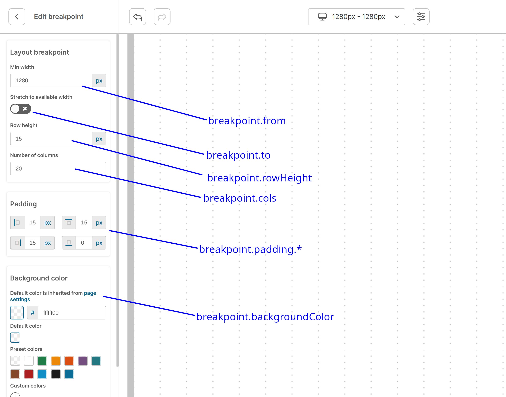

# Breakpoints
Breakpoints are available in builder for creating responsive design. Two default breakpoints are 360px for mobile and 1280px for desktop.

## Structure

| Prop | Type | Description |
| --- | --- | --- |
| id | string | unique breakpoint id |
| from | number | breakpoint width min in pixels |
| to | number / null | breakpoint width max (px). null is treated as 100% of available space |
| rowHeight | number | height of row in grid (px) |
| cols | number | number of columns in grid |
| backgroundColor | string | background color of breakpoint, if not passed - inherited from <a href="./02-PAGE.md">page</a> |
| padding.top | number | padding top in px |
| padding.top | number | padding top in px |
| padding.top | number | padding top in px |
| padding.top | number | padding top in px |
| view | Tree | internal prop created on page publish |
| template | Tree | read more about <a href="./04-TEMPLATES.md">templates</a> |



## Example

```jsx
import React from 'react';
import WebBuilder, { Page } from 'react-web-builder';

const page = {
  breakpoints: [
    {
      id: createUniqueId(),
      from: 360,
      to: null,
      cols: 5,
      rowHeight: 15,
      backgroundColor: '#f8f8f8',
      padding: {
        top: 15,
        left: 15,
        right: 15,
        bottom: 0,
      },
    },
    {
      id: createUniqueId(),
      from: 1280,
      to: null,
      cols: 10,
      rowHeight: 15,
      backgroundColor: '#f8f8f8',
      padding: {
        top: 15,
        left: 15,
        right: 15,
        bottom: 0,
      },
    },
  ],
} as Page;

export function BreakpointsExample() {
  return (
    <WebBuilder
      page={page}
    />
  );
}
```
