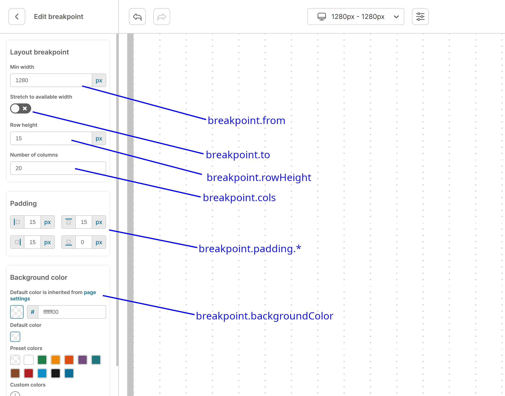

# Breakpoints

Breakpoints are how the builder handles responsive design. Each breakpoint has its own grid - its own column count, row height, padding and element layout - so a page can look completely different on mobile and on desktop while remaining one page.

The two defaults are **360px for mobile** and **1280px for desktop**. Users can add, edit and remove breakpoints in the interface, or you can define them up front through the [`page`](./02-PAGE.md) prop.



## How a breakpoint is matched

`from` and `to` describe the width range the breakpoint applies to:

- `from` - minimum width in pixels
- `to` - maximum width in pixels, or `null` for "up to 100% of the available space"

The grid itself is `cols` columns wide, each row is `rowHeight` pixels tall, and elements are positioned in column/row units - which is what keeps layouts consistent while the container resizes.

## Structure

| Prop | Type | Description |
| --- | --- | --- |
| id | string | Unique breakpoint id |
| parentId | string | Id of the breakpoint this one inherits its layout from |
| from | number | Minimum width in pixels |
| to | number \| null | Maximum width in pixels. `null` means 100% of the available space |
| rowHeight | number | Height of a single grid row in px |
| cols | number | Number of columns in the grid |
| backgroundColor | string | Background color. Inherited from the [page](./02-PAGE.md) when not set |
| padding.top | number | Top padding in px |
| padding.right | number | Right padding in px |
| padding.bottom | number | Bottom padding in px |
| padding.left | number | Left padding in px |
| view | Tree | Internal - the layout tree generated when the page is published |
| template | Tree | Starting layout ([read more](./04-TEMPLATES.md)) |

## Example

```tsx
import React from 'react';
import WebBuilder, { Page } from 'react-web-builder';

const page = {
  breakpoints: [
    {
      id: 'mobile',
      from: 360,
      to: null,
      cols: 5,
      rowHeight: 15,
      backgroundColor: '#f8f8f8',
      padding: {
        top: 15,
        left: 15,
        right: 15,
        bottom: 0,
      },
    },
    {
      id: 'desktop',
      from: 1280,
      to: null,
      cols: 10,
      rowHeight: 15,
      backgroundColor: '#f8f8f8',
      padding: {
        top: 15,
        left: 15,
        right: 15,
        bottom: 0,
      },
    },
  ],
} as Page;

export function BreakpointsExample() {
  return (
    <WebBuilder
      page={page}
    />
  );
}
```

Ids must be unique and stable - they are the keys under which elements are stored in `page.elementsInBreakpoints`. In the examples above they are plain strings for readability; in real applications generate them (for example with `crypto.randomUUID()`) and keep them unchanged across saves.

## Working with breakpoints in components

Anywhere the builder hands you a `breakpoint`, you can adapt to it. Two common patterns:

```jsx
// responsive default width, in columns
defaultWidth: ({ breakpoint }) => (breakpoint.from < 768 ? breakpoint.cols : 6)

// a field that only makes sense on small screens
visibility: ({ breakpoint }) => breakpoint.from < 768
```

See [components](./01-COMPONENTS.md#default-values) for the full list of places a breakpoint is available.
