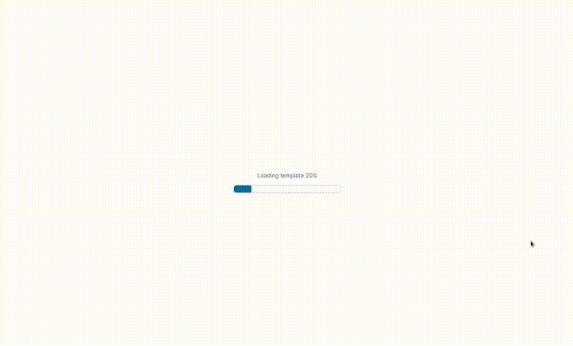

# Templates

Templates are a tree structure. They are used to prepare the starter layout of the builder, so that user can start from a certain state.



## Structure

| Prop | Type | Description |
| --- | --- | --- |
| id | string | id of tree node |
| children | Tree | recursive tree node element |
| marginLeft | number | margin left in <a href="./03-BREAKPOINTS.md">breakpoint</a> columns from left side |
| marginRight | number | margin right in <a href="./03-BREAKPOINTS.md">breakpoint</a> columns from right side |
| marginTop | number | margin top in <a href="./03-BREAKPOINTS.md">breakpoint</a> rows from top |
| marginBottom | number | margin bottom in <a href="./03-BREAKPOINTS.md">breakpoint</a> rows |
| paddingBottom | internal | - |
| element | WebBuilderElement | more about <a href="./01-COMPONENTS.md#element">element</a> |
| w | number | width of element in <a href="./03-BREAKPOINTS.md">breakpoint</a> columns |
| type | row / column / component / fixed | type of node |

## Example

LIVE

example below is using breakpoint objects (<a href="./03-BREAKPOINTS.md">read more</a>)

```jsx
import React from 'react';
import WebBuilder, { Page, Tree } from 'react-web-builder';

const createUniqueId = () => // ...

const templateDekstop: Tree = {
  id: createUniqueId(),
  marginBottom: 0,
  marginLeft: 0,
  marginRight: 0,
  marginTop: 0,
  type: 'row',
  w: 10,
  children: [
    {
      id: createUniqueId(),
      marginBottom: 0,
      marginLeft: 2,
      marginRight: 0,
      marginTop: 0,
      w: 8,
      type: 'component',
      element: {
        id: createUniqueId(),
        componentName: 'Box',
        props: [],
        h: 'auto',
        x: 0,
        y: 0,
        w: 8,
      },
    },
    {
      id: createUniqueId(),
      marginBottom: 0,
      marginLeft: 0,
      marginRight: 0,
      marginTop: 3,
      type: 'column',
      w: 10,
      children: [
        {
          id: createUniqueId(),
          marginBottom: 0,
          marginLeft: 0,
          marginRight: 0,
          marginTop: 0,
          w: 4,
          type: 'component',
          element: {
            id: createUniqueId(),
            componentName: 'Box',
            props: [],
            h: 'auto',
            x: 0,
            y: 0,
            w: 4,
          },
        },
        {
          id: createUniqueId(),
          marginBottom: 0,
          marginLeft: 2,
          marginRight: 0,
          marginTop: 0,
          w: 4,
          type: 'component',
          element: {
            id: createUniqueId(),
            componentName: 'Box',
            props: [],
            h: 'auto',
            x: 0,
            y: 0,
            w: 4,
          },
        },
      ],
    },
  ],
};

const templateMobile: Tree = {
  id: createUniqueId(),
  marginBottom: 0,
  marginLeft: 0,
  marginRight: 0,
  marginTop: 0,
  type: 'row',
  w: 5,
  children: [
    {
      id: createUniqueId(),
      marginBottom: 0,
      marginLeft: 1,
      marginRight: 0,
      marginTop: 0,
      w: 4,
      type: 'component',
      element: {
        id: createUniqueId(),
        componentName: 'Box',
        props: [],
        h: 'auto',
        x: 0,
        y: 0,
        w: 4,
      },
    },
    {
      id: createUniqueId(),
      marginBottom: 0,
      marginLeft: 1,
      marginRight: 0,
      marginTop: 2,
      w: 3,
      type: 'component',
      element: {
        id: createUniqueId(),
        componentName: 'Image',
        props: [
          {
            propId: 'url',
            value: { location: 'https://www.w3schools.com/html/img_chania.jpg' },
          },
        ],
        h: 'auto',
        x: 0,
        y: 0,
        w: 3,
      },
    },
    {
      id: createUniqueId(),
      marginBottom: 0,
      marginLeft: 0,
      marginRight: 0,
      marginTop: 3,
      type: 'column',
      w: 5,
      children: [
        {
          id: createUniqueId(),
          marginBottom: 0,
          marginLeft: 0,
          marginRight: 0,
          marginTop: 0,
          w: 3,
          type: 'component',
          element: {
            id: createUniqueId(),
            componentName: 'Box',
            props: [],
            h: 'auto',
            x: 0,
            y: 0,
            w: 3,
          },
        },
        {
          id: createUniqueId(),
          marginBottom: 0,
          marginLeft: 0,
          marginRight: 0,
          marginTop: 0,
          w: 2,
          type: 'component',
          element: {
            id: createUniqueId(),
            componentName: 'Box',
            props: [],
            h: 'auto',
            x: 0,
            y: 0,
            w: 2,
          },
        },
      ],
    },
    {
      id: createUniqueId(),
      marginBottom: 0,
      marginLeft: 0,
      marginRight: 0,
      marginTop: 2,
      w: 5,
      type: 'component',
      element: {
        id: createUniqueId(),
        componentName: 'CustomButton',
        props: [
          {
            propId: 'content',
            value: [{
              align: 'center',
              type: 'paragraph',
              children: [{
                fontSize: 18,
                text: 'Button',
              }],
            }],
          },
        ],
        h: 'auto',
        x: 0,
        y: 0,
        w: 5,
      },
    },
  ],
};

const template = {
  breakpoints: [
    {
      id: createUniqueId(),
      from: 360,
      to: null,
      cols: 5,
      rowHeight: 15,
      backgroundColor: '#f8f8f8',
      padding: {
        top: 15,
        left: 15,
        right: 15,
        bottom: 0,
      },
      template: templateMobile,
    },
    {
      id: createUniqueId(),
      from: 1280,
      to: null,
      cols: 10,
      rowHeight: 15,
      backgroundColor: '#f8f8f8',
      padding: {
        top: 15,
        left: 15,
        right: 15,
        bottom: 0,
      },
      template: templateDekstop,
    },
  ],
} as Page;

export function TemplateExample() {
  return (
    <WebBuilder
      page={template}
    />
  );
}
```
