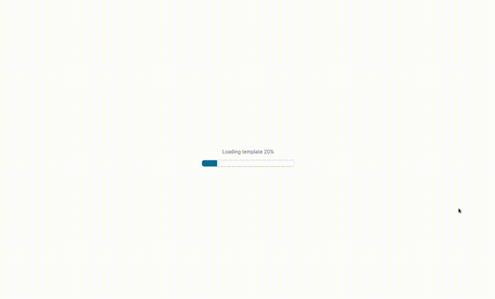

# Templates

A template is a tree that describes a starting layout. It is applied when the builder opens, so users begin from a real page instead of an empty grid.

Templates are declared per [breakpoint](./03-BREAKPOINTS.md), which means the mobile and desktop versions of the same starter layout can differ.



## How the tree works

Each node has a `type`:

| Type | Meaning |
| --- | --- |
| `row` | Stacks its children vertically |
| `column` | Places its children next to each other horizontally |
| `component` | A leaf holding a single `element` |
| `fixed` | A node whose position is not recalculated by the layout |

Sizes and margins are expressed in **grid units** - `w` and the horizontal margins in columns, the vertical margins in rows - so a template adapts to whatever `cols` the breakpoint declares.

## Structure

| Prop | Type | Description |
| --- | --- | --- |
| id | string | Unique id of the tree node |
| type | `row` \| `column` \| `component` \| `fixed` | Node type |
| children | Tree[] | Child nodes (for `row` and `column`) |
| element | WebBuilderElement | The element to render (for `component`) - [read more](./01-COMPONENTS.md#element) |
| w | number | Width of the node in [breakpoint](./03-BREAKPOINTS.md) columns |
| h | number | Height of the node in [breakpoint](./03-BREAKPOINTS.md) rows |
| marginLeft | number | Margin from the left, in columns |
| marginRight | number | Margin from the right, in columns |
| marginTop | number | Margin from the top, in rows |
| marginBottom | number | Margin from the bottom, in rows |
| paddingBottom | internal | Managed by the builder |

The `componentName` of an element must match the id of a built-in component (`Box`, `Image`, `Video`, `CustomButton`, `Line`, `Separator`, `Iframe`, `Anchor`, `HTMLComponent`, `Container`) or one of your own [components](./01-COMPONENTS.md).

## Example

The example below uses [breakpoint](./03-BREAKPOINTS.md) objects. A live version is available in `src/stories/Templates.stories.tsx`.

```tsx
import React from 'react';
import WebBuilder, { Page, Tree } from 'react-web-builder';

const createUniqueId = () => crypto.randomUUID();

const templateDesktop: Tree = {
  id: createUniqueId(),
  marginBottom: 0,
  marginLeft: 0,
  marginRight: 0,
  marginTop: 0,
  type: 'row',
  w: 10,
  children: [
    // a heading, indented by 2 columns
    {
      id: createUniqueId(),
      marginBottom: 0,
      marginLeft: 2,
      marginRight: 0,
      marginTop: 0,
      w: 8,
      type: 'component',
      element: {
        id: createUniqueId(),
        componentName: 'Box',
        props: [],
        h: 'auto',
        x: 0,
        y: 0,
        w: 8,
      },
    },
    // two text blocks side by side
    {
      id: createUniqueId(),
      marginBottom: 0,
      marginLeft: 0,
      marginRight: 0,
      marginTop: 3,
      type: 'column',
      w: 10,
      children: [
        {
          id: createUniqueId(),
          marginBottom: 0,
          marginLeft: 0,
          marginRight: 0,
          marginTop: 0,
          w: 4,
          type: 'component',
          element: {
            id: createUniqueId(),
            componentName: 'Box',
            props: [],
            h: 'auto',
            x: 0,
            y: 0,
            w: 4,
          },
        },
        {
          id: createUniqueId(),
          marginBottom: 0,
          marginLeft: 2,
          marginRight: 0,
          marginTop: 0,
          w: 4,
          type: 'component',
          element: {
            id: createUniqueId(),
            componentName: 'Box',
            props: [],
            h: 'auto',
            x: 0,
            y: 0,
            w: 4,
          },
        },
      ],
    },
  ],
};

const templateMobile: Tree = {
  id: createUniqueId(),
  marginBottom: 0,
  marginLeft: 0,
  marginRight: 0,
  marginTop: 0,
  type: 'row',
  w: 5,
  children: [
    {
      id: createUniqueId(),
      marginBottom: 0,
      marginLeft: 1,
      marginRight: 0,
      marginTop: 0,
      w: 4,
      type: 'component',
      element: {
        id: createUniqueId(),
        componentName: 'Box',
        props: [],
        h: 'auto',
        x: 0,
        y: 0,
        w: 4,
      },
    },
    // an image with a preset source
    {
      id: createUniqueId(),
      marginBottom: 0,
      marginLeft: 1,
      marginRight: 0,
      marginTop: 2,
      w: 3,
      type: 'component',
      element: {
        id: createUniqueId(),
        componentName: 'Image',
        props: [
          {
            propId: 'url',
            value: { location: 'https://www.w3schools.com/html/img_chania.jpg' },
          },
        ],
        h: 'auto',
        x: 0,
        y: 0,
        w: 3,
      },
    },
    // a button with preset rich text content
    {
      id: createUniqueId(),
      marginBottom: 0,
      marginLeft: 0,
      marginRight: 0,
      marginTop: 2,
      w: 5,
      type: 'component',
      element: {
        id: createUniqueId(),
        componentName: 'CustomButton',
        props: [
          {
            propId: 'content',
            value: [{
              align: 'center',
              type: 'paragraph',
              children: [{
                fontSize: 18,
                text: 'Button',
              }],
            }],
          },
        ],
        h: 'auto',
        x: 0,
        y: 0,
        w: 5,
      },
    },
  ],
};

const template = {
  breakpoints: [
    {
      id: createUniqueId(),
      from: 360,
      to: null,
      cols: 5,
      rowHeight: 15,
      backgroundColor: '#f8f8f8',
      padding: {
        top: 15,
        left: 15,
        right: 15,
        bottom: 0,
      },
      template: templateMobile,
    },
    {
      id: createUniqueId(),
      from: 1280,
      to: null,
      cols: 10,
      rowHeight: 15,
      backgroundColor: '#f8f8f8',
      padding: {
        top: 15,
        left: 15,
        right: 15,
        bottom: 0,
      },
      template: templateDesktop,
    },
  ],
} as Page;

export function TemplateExample() {
  return (
    <WebBuilder
      page={template}
    />
  );
}
```

## Presetting property values

Elements inside a template can carry values for their [properties](./01-COMPONENTS.md#props). Each entry uses `propId` (the property id) and `value` (in the shape that property type expects):

```jsx
element: {
  id: createUniqueId(),
  componentName: 'hero',
  props: [
    { propId: 'title', value: 'Ship faster' },
    { propId: 'backgroundColor', value: '#101828' },
    { propId: 'cta', value: { location: '/signup', openInNewTab: false } },
  ],
  h: 'auto',
  x: 0,
  y: 0,
  w: 10,
}
```

## Restarting a template

Pair templates with `onTemplateRestart` to let users start over from the initial layout:

```jsx
<WebBuilder
  page={template}
  onTemplateRestart={() => template}
/>
```
