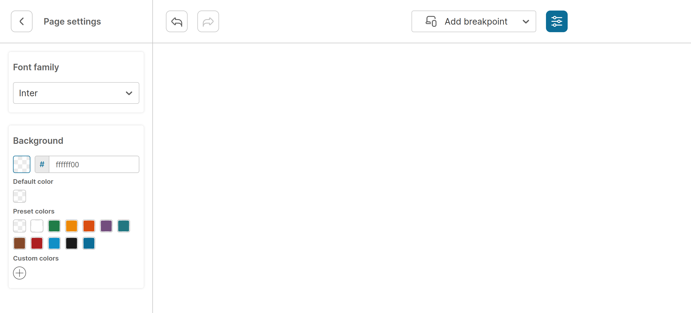

# Fonts
Feature for declaring fonts that can be used in Builder

## Structure
| Prop | Type | Description |
| --- | --- | --- |
| label | string | name of font (visible in sidebar) |
| value | string | unique id of font |
| fontFamily | string | CSS font family name |
| stylesheet | JSX | jsx applied to document body when <a href="./02-PAGE.md">page.fontFamily</a> is selected |

# Example

```jsx
import WebBuilder, { FontImport } from 'react-web-builder'

const fonts: FontImport[] = [
  {
    label: 'Alegreya',
    value: 'alegreya',
    fontFamily: "'Alegreya', serif",
    stylesheet: (
      <>
        <link rel='preconnect' href='https://fonts.googleapis.com' />
        <link rel='preconnect' href='https://fonts.gstatic.com' />
        <link href='https://fonts.googleapis.com/css2?family=Alegreya:ital,wght@0,400;0,700;1,400&display=swap' rel='stylesheet' />
      </>
    ),
  },
  {
    label: 'Inter',
    value: 'inter',
    fontFamily: "'Inter', sans-serif",
    stylesheet: (
      <>
        <link rel='preconnect' href='https://fonts.googleapis.com' />
        <link rel='preconnect' href='https://fonts.gstatic.com' />
        <link href='https://fonts.googleapis.com/css2?family=Inter:wght@400;700&display=swap' rel='stylesheet' />
      </>
    ),
  },
]

const page = {
  fontFamily: 'Inter', // default font
}

export function FontsExample() {
  return (
    <WebBuilder
      fonts={fonts}
      page={page}
    />
  );
}

/*
  fonts={fonts} should be also passed
  to <View /> component
*/

```


