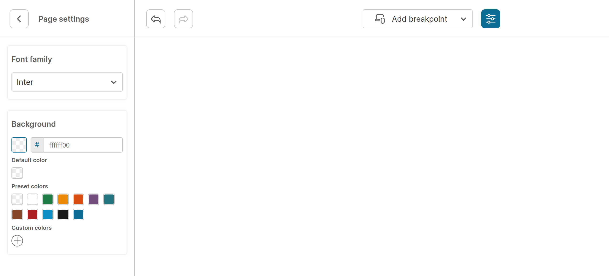

# Fonts

Declare the fonts that users can pick in the builder. A selected font applies to the whole [page](./02-PAGE.md) and is stored in `page.fontFamily`.



## Structure

| Prop | Type | Description |
| --- | --- | --- |
| label | string | Name of the font, visible in the sidebar |
| value | string | Unique id of the font - this is what ends up in [`page.fontFamily`](./02-PAGE.md) |
| fontFamily | string | CSS `font-family` value applied to the content |
| stylesheet | JSX | Markup injected into the document when this font is selected - typically `<link>` tags |

The builder renders its grid inside an iframe, which is why the `stylesheet` is declared as JSX rather than loaded globally: it is injected wherever the font is actually needed, in the editor and in [`<View />`](./00-INTRODUCTION.md#shared-properties) alike.

## Example

```jsx
import WebBuilder, { FontImport } from 'react-web-builder'

const fonts: FontImport[] = [
  {
    label: 'Alegreya',
    value: 'alegreya',
    fontFamily: "'Alegreya', serif",
    stylesheet: (
      <>
        <link rel='preconnect' href='https://fonts.googleapis.com' />
        <link rel='preconnect' href='https://fonts.gstatic.com' />
        <link href='https://fonts.googleapis.com/css2?family=Alegreya:ital,wght@0,400;0,700;1,400&display=swap' rel='stylesheet' />
      </>
    ),
  },
  {
    label: 'Inter',
    value: 'inter',
    fontFamily: "'Inter', sans-serif",
    stylesheet: (
      <>
        <link rel='preconnect' href='https://fonts.googleapis.com' />
        <link rel='preconnect' href='https://fonts.gstatic.com' />
        <link href='https://fonts.googleapis.com/css2?family=Inter:wght@400;700&display=swap' rel='stylesheet' />
      </>
    ),
  },
]

const page = {
  fontFamily: 'inter', // default font - matches the `value` field above
}

export function FontsExample() {
  return (
    <WebBuilder
      fonts={fonts}
      page={page}
    />
  );
}

/*
  fonts={fonts} must also be passed to <View />,
  otherwise the published page falls back to the default font
*/
```

## Self-hosted fonts

`stylesheet` is ordinary JSX, so a `@font-face` declaration works just as well as a Google Fonts link:

```jsx
{
  label: 'Suisse',
  value: 'suisse',
  fontFamily: "'Suisse', sans-serif",
  stylesheet: (
    <style>{`
      @font-face {
        font-family: 'Suisse';
        src: url('/fonts/suisse.woff2') format('woff2');
        font-weight: 400 700;
        font-display: swap;
      }
    `}</style>
  ),
}
```

## Per-component fonts

To let a single component override the page font, add a property of type [`fontFamily`](./01-COMPONENTS.md#fontfamily) - it renders a dropdown filled with the fonts declared here.
