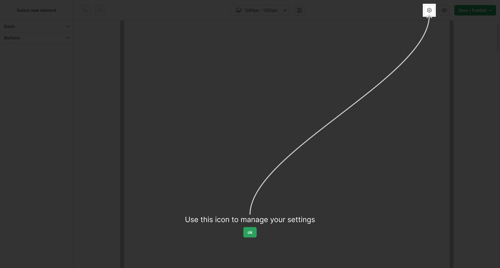

# Builder hints
Feature for showing hints to user. They will be only displayed once (visibility is saved in local storage). Could be combined with <a href="./08-NAVBAR-ICONS.md">navbar icons</a>.



## Structure
| Prop | Type | Description |
| --- | --- | --- |
| builderHints[].hasButton | boolean | is button close visible |
| builderHints[].selector | string | <a href="https://developer.mozilla.org/en-US/docs/Web/API/Document/querySelector">query selector</a> for element  |
| builderHints[].title | string | hint title/text |

## Example
```jsx
import WebBuilder from 'react-web-builder'

const builderHints = [
  {
    hasButton: true,
    selector: '[data-id="navbar-button"]',
    title: 'This is my navbar button',
  }
]

export function BuilderHints() {
  return (
    <WebBuilder
      builderHints={builderHints}
    />
  );
}
```