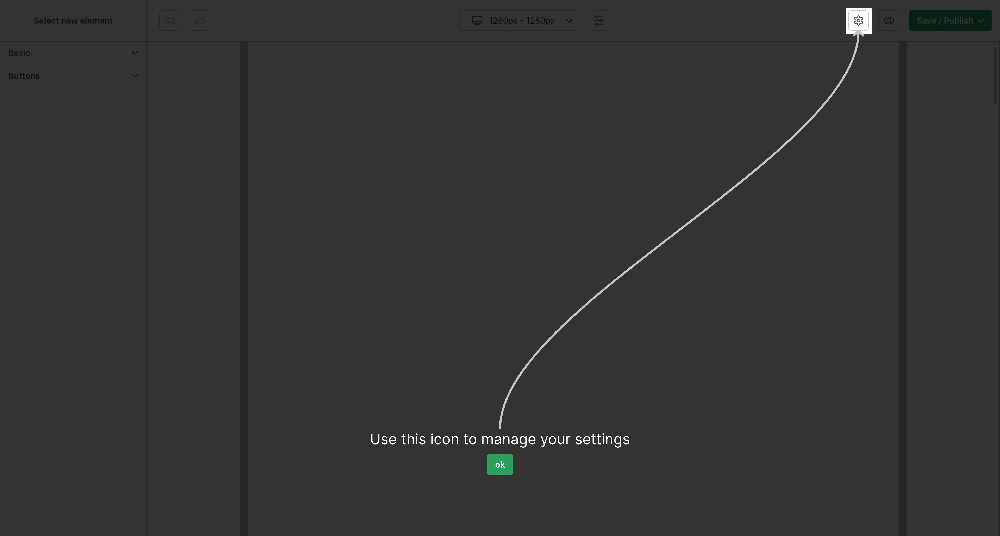

# Builder hints

Hints point users at parts of the interface with an arrow and a short message. Each hint is shown only once - its dismissal is remembered in local storage.

They work well together with [navbar icons](./08-NAVBAR-ICONS.md): add your own toolbar button, then explain it with a hint the first time a user opens the builder.



## Structure

| Prop | Type | Description |
| --- | --- | --- |
| builderHints[].selector | string | [Query selector](https://developer.mozilla.org/en-US/docs/Web/API/Document/querySelector) of the element the hint points at |
| builderHints[].title | string | Text of the hint |
| builderHints[].hasButton | boolean | Whether a close button is displayed |

## Example

```jsx
import WebBuilder from 'react-web-builder'

const builderHints = [
  {
    hasButton: true,
    selector: '[data-id="navbar-button"]',
    title: 'This is my navbar button',
  },
]

export function BuilderHints() {
  return (
    <WebBuilder
      builderHints={builderHints}
    />
  );
}
```

## Notes

- The selector is resolved against the live DOM, so the target element must already be rendered. Elements added by your own [navbar icons](./08-NAVBAR-ICONS.md) or [components](./01-COMPONENTS.md) are good anchors - give them a stable `data-id` attribute rather than relying on generated class names.
- Because dismissals are stored in local storage, hints will not reappear once closed. Users can bring them back with the "show tips again" action in the configuration menu (top-right corner); during development, clearing the site data works too.
- Treat hints as a one-time onboarding step rather than a notification channel.
