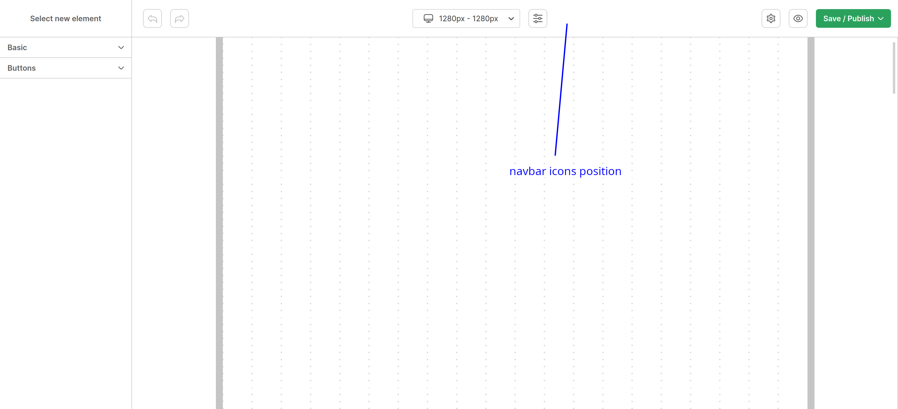

# Navbar icons
Feature for adding custom navbar icons

## Structure
| Prop | Type | Description |
| --- | --- | --- |
| navbarIcons[].id | string | unique id |
| navbarIcons[].icon | JSX | icon |
| navbarIcons[].tooltip | string | tooltip on hover |
| navbarIcons[].onClick | function | callback on click |
