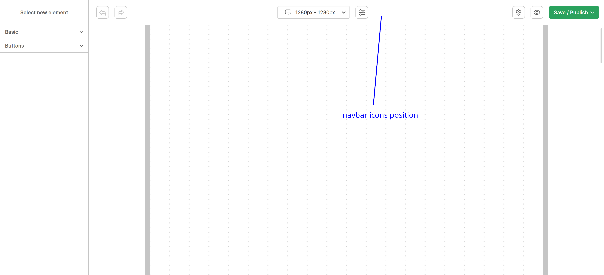

# Navbar icons

Add your own buttons to the builder's top navigation bar - a preview in a new tab, a link to your CMS, an SEO panel, anything your application needs. Each click handler receives the current [`page`](./02-PAGE.md).



## Structure

| Prop | Type | Description |
| --- | --- | --- |
| navbarIcons[].id | string | Unique id |
| navbarIcons[].icon | () => JSX | Component rendering the icon |
| navbarIcons[].tooltip | string | Tooltip shown on hover |
| navbarIcons[].onClick | ({ page }) => void | Callback fired on click, with the current page |

## Example

```jsx
import WebBuilder from 'react-web-builder'

const EyeIcon = () => (
  <svg width="20" height="20" viewBox="0 0 24 24" fill="none" stroke="currentColor">
    <path d="M1 12s4-8 11-8 11 8 11 8-4 8-11 8-11-8-11-8z" />
    <circle cx="12" cy="12" r="3" />
  </svg>
)

const navbarIcons = [
  {
    id: 'preview',
    icon: EyeIcon,
    tooltip: 'Open preview in a new tab',
    onClick: ({ page }) => {
      sessionStorage.setItem('preview', JSON.stringify(page))
      window.open('/preview', '_blank')
    },
  },
  {
    id: 'seo',
    icon: SeoIcon,
    tooltip: 'SEO settings',
    onClick: () => setSeoModalOpen(true),
  },
]

export function NavbarIconsExample() {
  return (
    <WebBuilder
      navbarIcons={navbarIcons}
    />
  );
}
```

## Notes

- Icons inherit the navbar's color, so an SVG using `currentColor` blends in with the built-in icons.
- Combine navbar icons with [builder hints](./07-BUILDER-HINTS.md) to explain a new button the first time a user sees it.
- For settings that belong to the page itself rather than to your application, consider `pageSettingsExtra` instead - it adds fields to the page settings panel using the same structure as [component properties](./01-COMPONENTS.md#props), and their values are stored inside the page.
